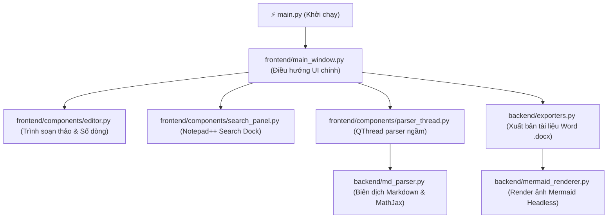

# MarkDocx - Advanced Markdown Viewer & Document Compiler (Offline-First)

<p align="center">
  
</p>

<p align="center">
  <a href="https://img.shields.io/badge/python-3.10+-blue.svg"></a>
  <a href="https://img.shields.io/badge/UI-PyQt6-orange.svg"></a>
  <a href="https://img.shields.io/badge/compiler-Pandoc-green.svg"></a>
  <a href="https://img.shields.io/badge/Mermaid-Offline-blueviolet.svg"></a>
  <a href="https://img.shields.io/badge/license-MIT-blue.svg"></a>
</p>

**MarkDocx** là trình biên dịch tài liệu (Document Compiler) và xem thử Markdown đa luồng nâng cao. Được thiết kế chuyên dụng cho kỹ sư kết cấu, nhà phát triển và soạn thảo báo cáo kỹ thuật với khả năng render biểu đồ Mermaid, công thức toán học MathJax hoàn toàn **Offline** và xuất bản tài liệu Microsoft Word (.docx) chất lượng cao.

---

## 🌟 Tại sao MarkDocx vượt trội hơn các trình đọc Markdown khác?

Giữa hàng trăm trình đọc Markdown trên GitHub và Internet, **MarkDocx** nổi bật nhờ việc giải quyết triệt để những "nỗi đau" kỹ thuật lớn nhất khi biên dịch tài liệu phức tạp:

### 1. 🚀 Headless Mermaid.js Compiler (Độc quyền & Trực quan)
* **Vấn đề của các công cụ khác**: Hầu hết các trình xem Markdown chỉ có thể render biểu đồ Mermaid.js trên trình duyệt web hiển thị (giao diện). Khi bạn muốn xuất file sang PDF hoặc Word, các khối Mermaid sẽ bị giữ nguyên dưới dạng mã code thô hoặc bị lỗi hiển thị.
* **Giải pháp của MarkDocx**: Tích hợp một bộ **Headless Renderer** sử dụng trình duyệt ảo ngầm (`QWebEngineView` ẩn) để tự động biên dịch mã Mermaid sang ảnh PNG thực tế ở độ phân giải gốc, sau đó tự động nhúng vào tài liệu trước khi xuất bản. Tất cả diễn ra **100% Offline**.

### 🧮 2. MathJax Offline (tex-svg) – Công thức toán học không cần mạng
* **Vấn đề của các công cụ khác**: Đa số các trình đọc Markdown dựa vào các thư viện CDN online (như MathJax/KaTeX qua internet) để hiển thị công thức toán học. Nếu mất mạng, tài liệu của bạn sẽ bị lỗi hiển thị công thức.
* **Giải pháp của MarkDocx**: Đóng gói sẵn thư viện MathJax (tex-svg) nội bộ. Cho phép render các công thức LaTeX phức tạp (cả inline `$` và block `$$`) hoàn hảo ngay cả khi máy tính của bạn hoàn toàn ngắt kết nối internet.

### 📝 3. Bộ dịch LaTeX-to-Unicode thông minh khi xuất DOCX
* Khi xuất tài liệu sang định dạng Microsoft Word (`.docx`), trình biên dịch tự động phân tích và chuyển đổi các công thức LaTeX toán học sang ký hiệu Unicode tương ứng, đảm bảo tài liệu Word hiển thị đẹp mắt, đồng bộ font chữ mà không cần cài đặt thêm plugin Equation phức tạp trên Microsoft Office.

### ⚡ 4. Kiến trúc Đa luồng Bất đồng bộ (Multi-threaded PyQt6 UI)
* Mọi tác vụ nặng bao gồm: Phân tích cú pháp Markdown, render biểu đồ Mermaid sang ảnh, nạp tài liệu lớn đều được đẩy xuống luồng phụ thông qua `QThread` (`MarkdownParserThread`). Giao diện người dùng (UI) luôn phản hồi mượt mà ở tần số quét cao, triệt tiêu hoàn toàn hiện tượng đơ/lag ứng dụng.

### 🔍 5. Tìm kiếm nâng cao Notepad++ Style
* Hỗ trợ tìm kiếm từ khóa thời gian thực với tính năng **Multi-highlight** (bôi vàng đồng thời nhiều kết quả) trên cả bảng Soạn thảo (Editor) lẫn Xem thử (Viewer).
* Tích hợp dock kết quả tìm kiếm Notepad++ style, hiển thị rõ số dòng và ngữ cảnh của từng kết quả, giúp duyệt tài liệu quy mô lớn cực nhanh.

---

## 🛠️ Kiến trúc Hệ thống (Modularity First)

Dự án được tái cấu trúc theo mô hình phân lớp rõ ràng, đảm bảo khả năng mở rộng dễ dàng:



---

## 🚀 Hướng dẫn cài đặt & Sử dụng

### Yêu cầu hệ thống
- Python 3.10 trở lên.
- Đã cài đặt **Pandoc** trên hệ thống (để phục vụ tính năng xuất DOCX).

### Cài đặt thư viện
```bash
pip install -r requirements.txt
```

### Khởi chạy ứng dụng
```bash
python main.py
```

---

## 📝 Nhật ký Phát triển & Chất lượng kiểm toán
Dự án áp dụng bộ tiêu chuẩn Clean Code và quy trình tự động hóa nghiêm ngặt:
- **Quality Score**: Đạt **10.0/10.0** điểm kiểm toán chất lượng tĩnh (AST Audit) với **0 lỗi Blocker**.
- **Linter**: Đã tối ưu hóa và làm sạch toàn bộ imports / biến thừa thông qua Ruff linter.
- **Git Guard**: Tích hợp pre-commit hook tự động kiểm tra Modularity (giới hạn file 800 dòng, hàm 100 dòng, đối số tối đa 4) để bảo vệ codebase khỏi nợ kỹ thuật.
